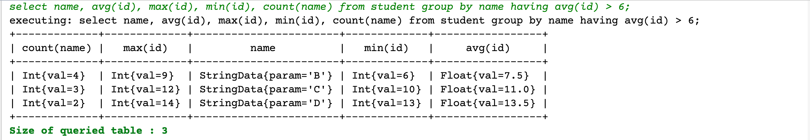

# makeyourowndatabase
A toy database implemented in java!

Results are like fllowing images:



```shell
select * from student;
executing: select * from student;
+-----------------------+-------------+
|         name          |     id      |
+-----------------------+-------------+
| StringData{param='A'} | Int{val=1}  |
| StringData{param='A'} | Int{val=2}  |
| StringData{param='A'} | Int{val=3}  |
| StringData{param='A'} | Int{val=4}  |
| StringData{param='A'} | Int{val=5}  |
| StringData{param='B'} | Int{val=6}  |
| StringData{param='B'} | Int{val=7}  |
| StringData{param='B'} | Int{val=8}  |
| StringData{param='B'} | Int{val=9}  |
| StringData{param='C'} | Int{val=10} |
| StringData{param='C'} | Int{val=11} |
| StringData{param='C'} | Int{val=12} |
| StringData{param='D'} | Int{val=13} |
| StringData{param='D'} | Int{val=14} |
+-----------------------+-------------+
Size of queried table : 14
>>>delete from student where name=='A';
executing: delete from student where name=='A';
Delete OK;
>>>select * from student;
executing: select * from student;
+-----------------------+-------------+
|         name          |     id      |
+-----------------------+-------------+
| StringData{param='B'} | Int{val=6}  |
| StringData{param='B'} | Int{val=7}  |
| StringData{param='B'} | Int{val=8}  |
| StringData{param='B'} | Int{val=9}  |
| StringData{param='C'} | Int{val=10} |
| StringData{param='C'} | Int{val=11} |
| StringData{param='C'} | Int{val=12} |
| StringData{param='D'} | Int{val=13} |
| StringData{param='D'} | Int{val=14} |
+-----------------------+-------------+
Size of queried table : 9
>>>
```


```shell
>>> select name, avg(id), max(id), min(id), count(name) from stu group by name having avg(id) > 6;
executing: select name, avg(id), max(id), min(id), count(name) from stu group by name having avg(id) > 6;
+-------------+-------------+-------------------------+-------------+-----------------+
| count(name) |   max(id)   |          name           |   min(id)   |     avg(id)     |
+-------------+-------------+-------------------------+-------------+-----------------+
| Int{val=3}  | Int{val=14} | StringData{param='tyx'} | Int{val=12} | Float{val=13.0} |
| Int{val=1}  | Int{val=7}  |  StringData{param='B'}  | Int{val=7}  | Float{val=7.0}  |
| Int{val=1}  | Int{val=8}  |  StringData{param='C'}  | Int{val=8}  | Float{val=8.0}  |
| Int{val=1}  | Int{val=9}  |  StringData{param='D'}  | Int{val=9}  | Float{val=9.0}  |
| Int{val=1}  | Int{val=10} |  StringData{param='E'}  | Int{val=10} | Float{val=10.0} |
| Int{val=1}  | Int{val=11} |  StringData{param='F'}  | Int{val=11} | Float{val=11.0} |
+-------------+-------------+-------------------------+-------------+-----------------+
Size of queried table : 6
```

